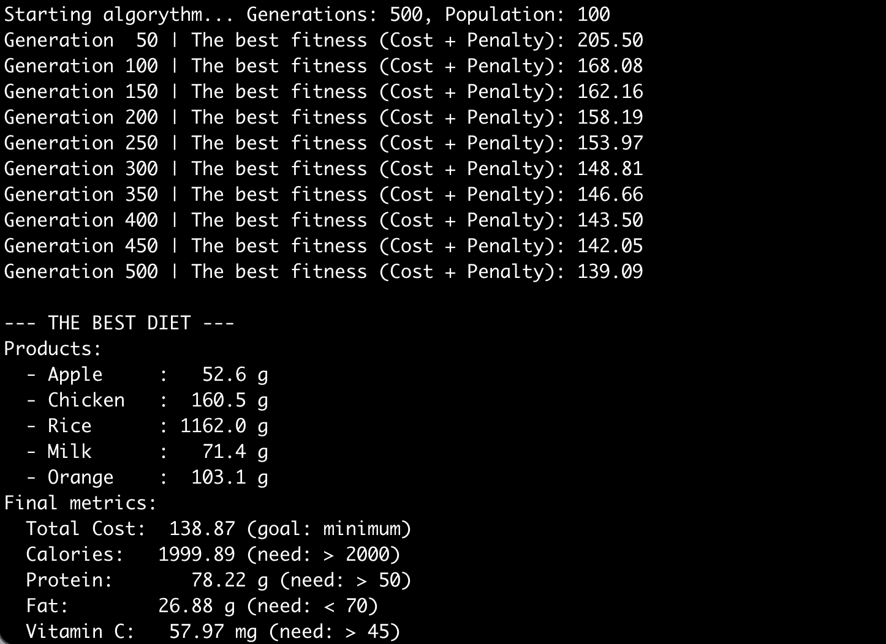

# Genetic Algorithm Diet Problem

This project solves the diet optimization problem using a genetic algorithm. The goal is to find the most cost-effective combination of foods that meets all nutritional requirements.



## Problem Description

The diet problem is a classic optimization challenge: select a set of foods to satisfy daily nutritional needs (such as calories, protein, fat, vitamins, etc.) at minimal cost. Constraints are based on recommended dietary allowances.

## Approach

- **Genetic Algorithm**: The solution uses a genetic algorithm to search for optimal food combinations. Individuals represent possible diets, and the algorithm evolves these solutions over generations.
- **Fitness Function**: Evaluates how well a diet meets nutritional constraints and minimizes cost.
- **Selection, Crossover, Mutation**: Standard genetic operators are used to generate new populations and explore the solution space.

## Project Structure

- `main.py`: Entry point for running the genetic algorithm.
- `algorythm.py`: Contains the genetic algorithm implementation.
- `data.py`: Defines food items and nutritional data.
- `util.py`: Utility functions for calculations and data handling.
- `README.md`: Project documentation.

## How to Run

1. Ensure you have Python 3 installed.
2. Run the main script:
	```bash
	python main.py
	```
3. The program will output the best diet found and its cost.

## Customization

- You can modify food data and nutritional constraints in `data.py`.
- Genetic algorithm parameters (population size, mutation rate, etc.) can be adjusted in `data.py`.

## Requirements

No external dependencies are required for basic functionality. All code is written in pure Python.